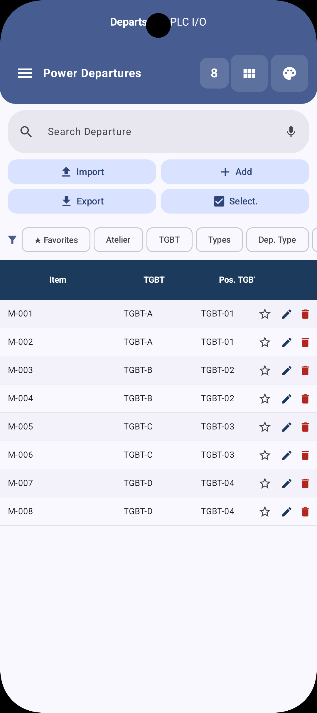
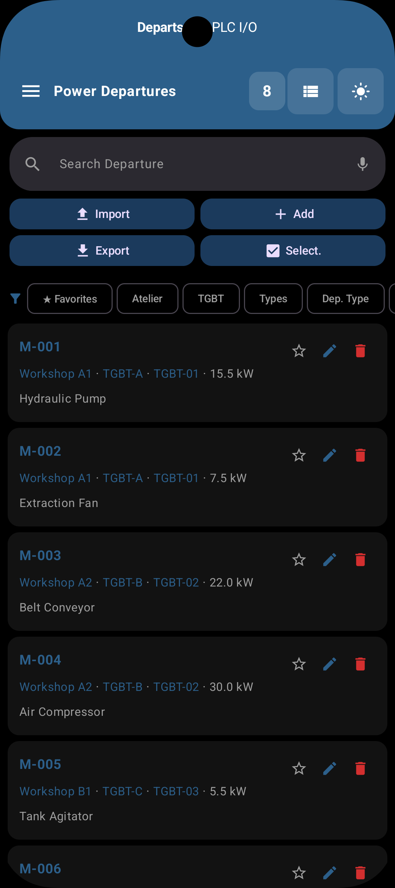
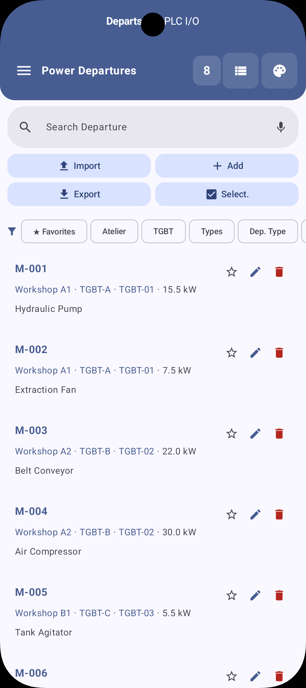
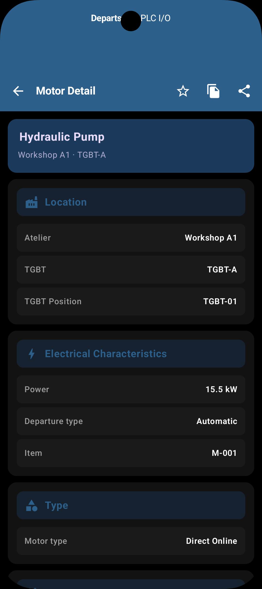
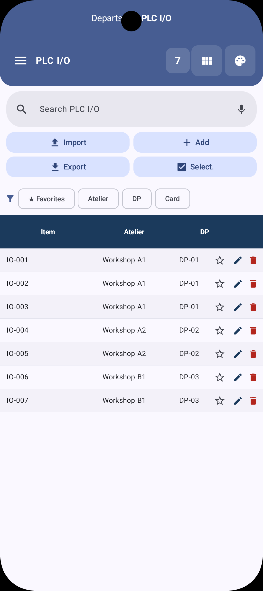
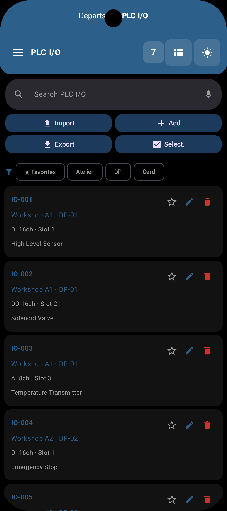
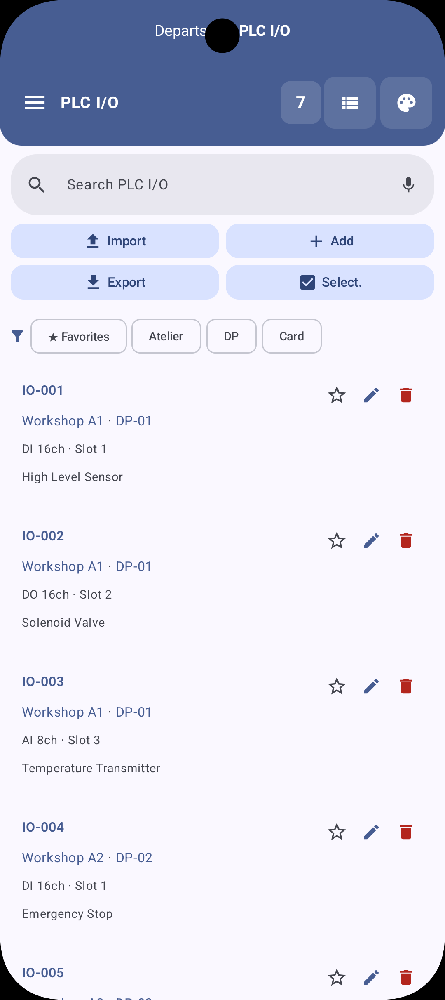
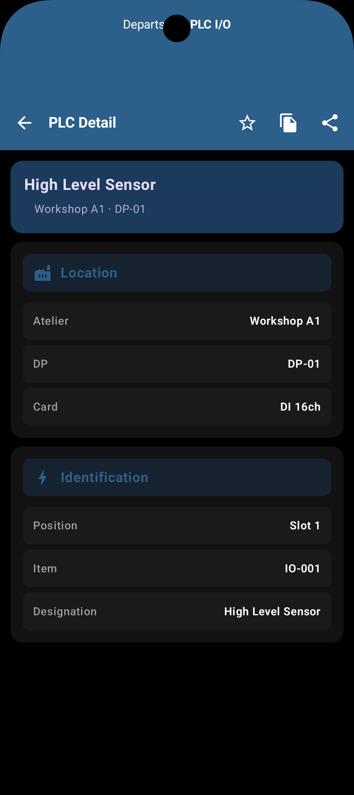
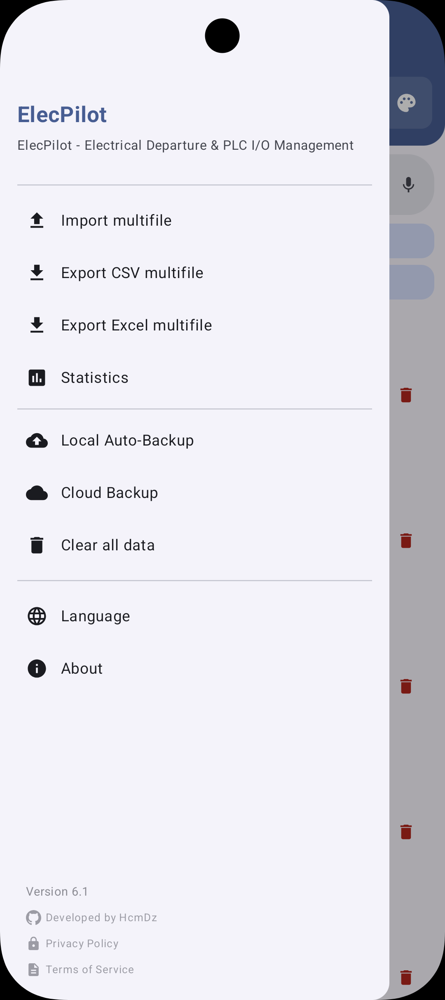
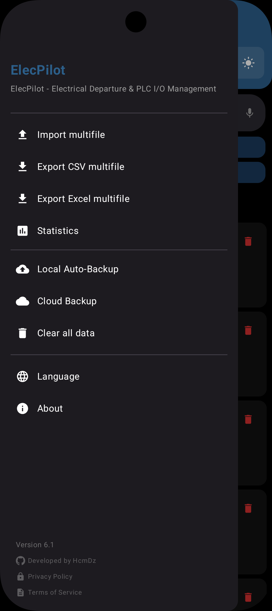

# ElecPilot

[](https://www.android.com)
[](https://kotlinlang.org)
[](#)
[](#)
[](https://www.gnu.org/licenses/gpl-3.0)

Android application for managing electrical motor starters and PLC I/O modules in industrial environments.

- **Package**: `com.HcmDz.ElecPilot`
- **Version**: 6.1 (versionCode 26)
- **Author**: HcmDZ &lt;HcmDz.Dev@gmail.com&gt;

---

## Screenshots

### Motor Starters

| Light Mode | Dark Mode |
|---|---|
|  |  |
|  | |
|  | |

### PLC I/O Modules

| Light Mode | Dark Mode |
|---|---|
|  |  |
|  | |
|  | |

### Settings

| Light Mode | Dark Mode |
|---|---|
|  |  |

---

## Key Features

- **Motor starter management** — full CRUD, search, batch edit, statistics
- **PLC I/O module management** — dedicated database and views
- **Cloud backup/restore** — Google Drive & OneDrive via rclone (AES-256-GCM encrypted config)
- **Local backup** — Excel & CSV export/import with scheduled backups
- **Material You theming** — dynamic color, edge-to-edge
- **Multilingual** — EN/FR/AR localization
- **Voice search** — speak to filter motor starters
- **Security hardened** — FLAG_SECURE, encrypted rclone config, WebView URL allowlist, ProGuard log stripping

---

## Tech Stack & Architecture

### Architecture

- **Single-module** app with `MainActivity` + Jetpack Compose navigation
- Data layer: Room databases + Repository pattern
- ViewModels with StateFlow
- WorkManager for scheduled backups (local + cloud)

### Core Libraries & Tools

| Category | Library | Version |
|---|---|---|
| **UI** | Jetpack Compose + Material 3 | BOM 2026.06.00 |
| **Async** | Kotlin Coroutines & Flow | 1.10.1 |
| **Database** | Room | 2.8.4 |
| **Networking** | OkHttp | 5.4.0 |
| **Cloud** | rclone (native binary, UPX compressed) | custom build |
| **Excel** | Apache POI (shadow jar from centic9/poi-on-android) | 5.2.5 |
| **Scheduling** | WorkManager | 2.10.1 |
| **File Access** | DocumentFile (SAF) | 1.1.0 |
| **Browser** | AndroidX Custom Tabs | 1.8.0 |
| **Security** | AES-256-GCM (Android KeyStore), ProGuard, NSC | — |
| **Build** | AGP 9.2.1, Kotlin 2.4.10, KSP 2.3.10 | — |
| **Lint** | Android Security Lint | 1.0.4 |

### Security Features (v6.0)

| Control | Implementation |
|---|---|
| **Encryption at rest** | AES-256-GCM via Android KeyStore (StrongBox+TEE fallback) for rclone config and cloud cache |
| **Screenshot protection** | `FLAG_SECURE` on MainActivity |
| **WebView hardening** | URL allowlist (OAuth providers only), `allowFileAccess=false`, `mixedContent=NEVER_ALLOW` |
| **Log stripping** | ProGuard strips `Log.d/v/i/e/w` (including exception stack traces) in release builds |
| **Network security** | Cleartext blocked (NSC), localhost exception only for rclone OAuth |
| **Backup disabled** | `allowBackup="false"` |
| **MTE** | `memtagMode="sync"` enabled in manifest |

---

## Getting Started

### Prerequisites

- **Android Studio**: Latest stable (Meerkat or newer)
- **JDK**: 17
- **Android SDK**: compileSdk 37
- **NDK**: 26.1.10909125
- **Go**: 1.22+ (for rclone custom build)

### Build APK

```bash
cd "ElecPilot"
./gradlew assembleRelease
```

Output: `app/build/outputs/apk/release/ElecPilot-release.apk`

### Run on Device

1. Open the project in **Android Studio**.
2. Wait for Gradle sync to complete.
3. Select a device or emulator running **API 29+**.
4. Press **Run** (Shift + F10) or:
   ```bash
   ./gradlew installDebug
   ```

---

## Testing

```bash
./gradlew test
./gradlew connectedAndroidTest
```

---

## Project Structure

```
app/src/main/java/com/HcmDz/ElecPilot/
├── MainActivity.kt              # Single activity, edge-to-edge, FLAG_SECURE
├── data/
│   ├── db/                      # Room databases (Motor + PLC)
│   ├── repository/              # Data repositories
│   └── BackupPreferences.kt     # Backup settings models
├── ui/
│   ├── screens/                 # Compose screens (Main, MotorDetail, dialogs)
│   ├── viewmodel/               # ViewModels
│   ├── components/              # Reusable UI components
│   ├── theme/                   # Material 3 theming
│   └── views/plc/               # PLC-specific views
├── util/
│   ├── BackupManager.kt         # Local backup (Excel/CSV)
│   ├── CloudBackupManager.kt    # Cloud backup orchestration
│   ├── RcloneDriveService.kt    # rclone CLI wrapper
│   ├── RcloneAuthActivity.kt    # OAuth WebView flow
│   ├── CryptoManager.kt         # AES-256-GCM encryption
│   ├── ExcelUtil.kt             # Apache POI export/import
│   └── NotificationHelper.kt    # Backup notifications
└── worker/
    ├── BackupWorker.kt          # WorkManager: local backup
    └── CloudBackupWorker.kt     # WorkManager: cloud backup
```

---

## Apache POI Shadow Jar

Apache POI is bundled as a pre-built shadow jar from [centic9/poi-on-android](https://github.com/centic9/poi-on-android) rather than as a standard Maven dependency.

### Why a shadow jar?

Raw Maven POI + R8 (the Android minifier) is fundamentally broken. R8's obfuscation breaks xmlbeans' `SchemaTypeSystemImpl` class name parsing, and R8's shrinking generates broken synthetic bridge classes. The shadow jar solves this by:

- Relocating `javax.xml.stream` → `org.apache.poi.javax.xml.stream` (Android lacks the full StAX API)
- Relocating `javax.xml.namespace` → `org.apache.poi.javax.xml.namespace`
- Replacing missing `java.awt.*` classes with stubs
- Bundling the [aalto-xml](https://github.com/FasterXML/aalto-xml) StAX implementation
- Merging all POI dependencies into a single jar

The shadow jar is located at `app/libs/poishadow-all.jar` (~19.5 MB raw). R8 strips unused POI classes during release builds.

### System properties

The relocated StAX parsers require system properties to be set before any POI code runs. This is handled in `ExcelUtil.kt`:

```kotlin
System.setProperty("org.apache.poi.javax.xml.stream.XMLInputFactory", "com.fasterxml.aalto.stax.InputFactoryImpl")
System.setProperty("org.apache.poi.javax.xml.stream.XMLOutputFactory", "com.fasterxml.aalto.stax.OutputFactoryImpl")
System.setProperty("org.apache.poi.javax.xml.stream.XMLEventFactory", "com.fasterxml.aalto.stax.EventFactoryImpl")
System.setProperty("org.apache.poi.ss.ignoreMissingFontSystem", "true")
```

### Updating the shadow jar

To build a newer version:

```bash
git clone https://github.com/centic9/poi-on-android.git
cd poi-on-android
./gradlew :poishadow:shadowJar
cp poishadow/build/libs/poishadow-all.jar <path-to-ElecPilot>/app/libs/
```

The master branch of centic9/poi-on-android uses POI 5.5.1. The pre-built release (5.2.5-4) uses POI 5.2.5. Both work for basic xlsx read/write.

---

## Custom Rclone Binary

The app bundles a custom-built rclone binary (`librclone.so`) with only the backends and commands needed for cloud backup. This keeps the binary small.

### Backends included

- `local` — local filesystem (required for upload/download)
- `drive` — Google Drive
- `onedrive` — OneDrive

### Commands included

- `authorize`, `config`, `copyto`, `delete`, `deletefile`, `listremotes`, `lsf`, `mkdir`

### Rebuild rclone

**Important**: After rebuilding the rclone binary, you MUST compress it with UPX before copying it into the project. Without UPX, the APK will be ~17 MB larger.

#### Step 1: Build for arm64

```bash
export GOROOT=/tmp/go && export PATH=$GOROOT/bin:$PATH
export ANDROID_NDK_HOME=$ANDROID_SDK_HOME/ndk/26.1.10909125
export PATH=$ANDROID_NDK_HOME/toolchains/llvm/prebuilt/linux-x86_64/bin:$PATH

cd /tmp/rclone
GOOS=android GOARCH=arm64 CGO_ENABLED=1 \
  CC=aarch64-linux-android34-clang \
  CXX=aarch64-linux-android34-clang++ \
  go build -ldflags="-s -w" -trimpath -o /tmp/librclone_arm64.so .
```

#### Step 2: Compress with UPX

```bash
/tmp/upx-4.2.4-amd64_linux/upx --best /tmp/librclone_arm64.so
```

This compresses the binary from ~23 MB to ~6.7 MB (71% reduction).

#### Step 3: Copy into the project

```bash
cp /tmp/librclone_arm64.so app/src/main/jniLibs/arm64-v8a/librclone.so
```

#### Step 4: Build the APK

```bash
cd ElecPilot
./gradlew clean assembleRelease
```

### Rebuild for emulator (x86_64)

To test on the x86_64 emulator, build for amd64 and add `"x86_64"` to `abiFilters` in `app/build.gradle.kts`:

```bash
GOOS=android GOARCH=amd64 CGO_ENABLED=1 \
  CC=x86_64-linux-android34-clang \
  CXX=x86_64-linux-android34-clang++ \
  go build -ldflags="-s -w" -trimpath -o /tmp/librclone_x86_64.so .
```

Then add `"x86_64"` to `abiFilters` in `app/build.gradle.kts`:

```kotlin
abiFilters += listOf("arm64-v8a", "x86_64")
```

> **Note**: Release builds only target `arm64-v8a`. The debug build includes both `arm64-v8a` and `x86_64` for emulator testing.

---

## Cloud Backup

Cloud backup uses rclone as a CLI executable (via `ProcessBuilder`). OAuth tokens are stored encrypted (AES-256-GCM via Android KeyStore) in `rclone.conf.enc` in the app's internal storage. The app communicates with rclone through stdout/stderr of the process.

### OAuth Flow

1. `RcloneAuthActivity` starts rclone `authorize` in background
2. rclone outputs a local auth URL on stderr
3. The WebView loads the URL (allowlisted hosts only)
4. User authenticates with Google/Microsoft
5. Token is captured from rclone stdout and saved encrypted

### Security

- Config file encrypted at rest with AES-256-GCM (Android KeyStore)
- Temp config files are owner-only readable (`setReadable(true, true)`)
- WebView URL allowlist restricts OAuth flow to known providers only
- Cloud backup disk cache is encrypted before writing to disk

---

## Signing

The release APK is signed with a keystore. To build a release APK:

1. Create a `gradle.properties` file in the project root (already gitignored)
2. Add the following properties:

```properties
RELEASE_STORE_FILE=/path/to/your/release.keystore
RELEASE_STORE_PASSWORD=your_store_password
RELEASE_KEY_PASSWORD=your_key_password
```

3. Run `./gradlew assembleRelease`

---

## APK Size

Current release APK size: **~20 MB** (arm64 only, R8 enabled).

| Component | Size |
|---|---|
| `librclone.so` (UPX compressed) | ~6.5 MB |
| POI shadow jar classes (after R8) | ~3 MB |
| Compose + AndroidX | ~5 MB |
| Other (Room, OkHttp, etc.) | ~5.5 MB |

Size reduction techniques applied:
- UPX compression on the rclone native binary
- POI shadow jar + R8 to strip unused Apache POI/xmlbeans classes
- `abiFilters` restricted to `arm64-v8a` for release builds
- `isMinifyEnabled = true` + `isShrinkResources = true` with ProGuard rules from centic9/poi-on-android

---

## Changelog (v5.7 → v6.1)

Security audit fixes (OWASP MASVS 2.1):

| # | Severity | Fix |
|---|---|---|
| 1 | CRITICAL | Rclone temp config file: owner-only readable permissions |
| 2 | HIGH | WebView OAuth URL allowlist to prevent phishing |
| 4 | MEDIUM | Cloud backup disk cache encrypted (AES-256-GCM) |
| 5 | MEDIUM | `FLAG_SECURE` on MainActivity (screenshot/recording protection) |
| 7 | LOW | HOME env fallback uses `filesDir` instead of hardcoded path |
| 8 | LOW | SharedPreferences `MODE_PRIVATE` explicit usage |
| 9 | LOW | Error logs stripped of file paths and operation details |
| 10 | LOW | ProGuard strips `Log.e/w` with exception objects in release |

---

## License

[](https://www.gnu.org/licenses/gpl-3.0)

This project is licensed under the **GNU General Public License v3.0** — see the [LICENSE](LICENSE) file for details.
