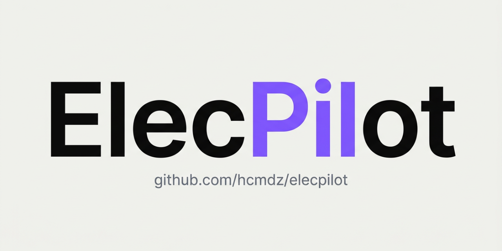

# ElecPilot
<a id="readme-top"></a>

[](https://github.com/Hcmdz/ElecPilot/releases/latest)

**Read this in other languages**

🇺🇸 [English](README.md) | 🇫🇷 [Français](docs/translations/README.fr-FR.md) | 🇸🇦 [العربية](docs/translations/README.ar-SA.md)
<!-- Localized app: values-fr/values-ar (+ldrtl) mirror README langs; supportsRtl verified. -->

[](https://www.android.com)
[](https://kotlinlang.org)
[](#)
[](#)
[](https://www.gnu.org/licenses/gpl-3.0)
[](https://github.com/Hcmdz/ElecPilot/releases/latest)
[](https://github.com/Hcmdz/ElecPilot/releases)
[](https://github.com/Hcmdz/ElecPilot/stargazers)
[](https://github.com/Hcmdz/ElecPilot/network/members)
[](https://developer.android.com/jetpack/compose)

Android application for managing electrical motor starters and PLC I/O modules in industrial environments.

In the field, motor data lives on paper or scattered spreadsheets — lost, outdated, unsearchable. ElecPilot is the offline-first field notebook: every starter and PLC module recorded once, found in seconds, backed up encrypted.

- **Package**: `com.HcmDz.ElecPilot`
- **Version**: 6.5.2 (versionCode 32)
- **Author**: HcmDZ &lt;HcmDz.Dev@gmail.com&gt;

---

<p align="center">
  <a href="#screenshots">View Demo</a>
  ·
  <a href="https://github.com/Hcmdz/ElecPilot/issues/new?labels=bug">Report Bug</a>
  ·
  <a href="https://github.com/Hcmdz/ElecPilot/issues/new?labels=enhancement">Request Feature</a>
</p>

<details>
<summary>Table of Contents</summary>

- [📦 Downloads](#-downloads)
- [Screenshots](#screenshots)
- [Key Features](#key-features)
- [Tech Stack & Architecture](#tech-stack--architecture)
- [Getting Started](#getting-started)
- [Testing](#testing)
- [Project Structure](#project-structure)
- [Apache POI Shadow Jar](#apache-poi-shadow-jar)
- [Custom Rclone Binary](#custom-rclone-binary)
- [Cloud Backup](#cloud-backup)
- [Signing](#signing)
- [APK Size](#apk-size)
- [Changelog](#changelog-v57--v651)
- [Legal](#legal)
- [License](#license)
- [Roadmap](#️-roadmap)
- [Related Docs](#related-docs)
- [Contact](#-contact)
</details>

---

## 📦 Downloads

Get ElecPilot on GitHub: **[Latest release](https://github.com/Hcmdz/ElecPilot/releases/latest)** (`ElecPilot-release.apk`, ~21 MB, `arm64-v8a`).

[](https://github.com/Hcmdz/ElecPilot/releases/latest)

- Requires Android 9+ (API 29) with **arm64-v8a**; allow *Install unknown apps* for your browser when prompted.
- Verify integrity: `sha256sum -c ElecPilot-release.apk.sha256` (sidecar next to the APK).
- ⚠️ Coming from ≤ 6.5: manual reinstall required (new signing key since 6.5.1 — back up, uninstall, install, restore).

<p align="right">(<a href="#readme-top">back to top</a>)</p>

---

## Screenshots

Find any starter in seconds, light or dark — lists, details, and settings at a glance.

### Motor Starters

| Light Mode | Dark Mode |
|---|---|
| [](screenshots/motor-list-table-view-light.png) | [](screenshots/motor-list-table-view-dark.png) |
| [](screenshots/motor-list-card-view-light.png) | |
| [](screenshots/motor-detail-dark.png) | |

### PLC I/O Modules

Every module on record — table or card view, with full detail per module.

| Light Mode | Dark Mode |
|---|---|
| [](screenshots/plc-list-table-view-light.png) | [](screenshots/plc-list-card-view-dark.png) |
| [](screenshots/plc-list-card-view-light.png) | |
| [](screenshots/plc-detail-dark.png) | |

### Settings

Backup, language, and updates — everything configurable in one place.

| Light Mode | Dark Mode |
|---|---|
| [](screenshots/settings-light.png) | [](screenshots/settings-dark.png) |

<p align="right">(<a href="#readme-top">back to top</a>)</p>

---

## Key Features

### Motor Starters
- **Every starter on record.** Full CRUD, search, batch edit, statistics.
- **Hands-free lookup.** Speak to filter motor starters with voice search.
- **Start from a clean sheet.** Ready-to-fill Excel templates for motor starters and PLC I/O.

### PLC I/O Modules
- **Every module on record.** Dedicated database and views for PLC I/O modules.

### Backup & Sync
- **Your data survives the phone.** Cloud backup/restore via Google Drive & OneDrive with rclone (AES-256-GCM encrypted config).
- **Paper trail on demand.** Local backup with Excel & CSV export/import and scheduled backups.

### App
- **Always up to date.** In-app update with auto-check & download from GitHub Releases.
- **Looks at home.** Material You theming with dynamic color, edge-to-edge.
- **Speaks your language.** System/EN/FR/AR localization with auto-detect of the device language.
- **Hardened by default.** FLAG_SECURE, encrypted rclone config, WebView URL allowlist, ProGuard log stripping.

<p align="right">(<a href="#readme-top">back to top</a>)</p>

---

## Tech Stack & Architecture

### Architecture

- **Single-module** app with `MainActivity` + Jetpack Compose navigation
- Data layer: Room databases + Repository pattern
- ViewModels with StateFlow
- WorkManager for scheduled backups (local + cloud)

### Core Libraries & Tools

| Category | Library | Version |
|---|---|---|
| **UI** | Jetpack Compose + Material 3 | BOM 2026.09.00 |
| **Activity** | Activity Compose | 1.13.0 |
| **Lifecycle** | Lifecycle Runtime Compose | 2.11.0 |
| **Async** | Kotlin Coroutines & Flow | 1.11.0 |
| **Database** | Room | 2.8.5 |
| **Networking** | OkHttp | 5.5.0 |
| **Cloud** | rclone (native binary, UPX compressed) | custom build |
| **Excel** | Apache POI (shadow jar from centic9/poi-on-android) | 5.2.5 |
| **Scheduling** | WorkManager | 2.11.2 |
| **File Access** | DocumentFile (SAF) | 1.1.0 |
| **Browser** | AndroidX Custom Tabs | 1.10.0 |
| **Security** | AES-256-GCM (Android KeyStore), ProGuard, NSC | — |
| **Build** | AGP 9.4.0, Kotlin 2.4.10, KSP 2.3.12 | — |
| **Lint** | Android Security Lint | 1.0.4 |
| **Quality** | Detekt CLI | 1.23.8 |
| **Testing** | JUnit4, Room Testing, Coroutines Test | 4.13.2 / 2.8.5 / 1.11.0 |

### Security Features (v6.0)

| Control | Implementation |
|---|---|
| **Encryption at rest** | AES-256-GCM via Android KeyStore (StrongBox+TEE fallback) for rclone config and cloud cache |
| **Screenshot protection** | `FLAG_SECURE` on MainActivity |
| **WebView hardening** | URL allowlist (OAuth providers only), `allowFileAccess=false`, `mixedContent=NEVER_ALLOW` |
| **Log stripping** | ProGuard strips `Log.d/v/i/e/w` (including exception stack traces) in release builds |
| **Network security** | Cleartext blocked (NSC), localhost exception only for rclone OAuth |
| **Backup disabled** | `allowBackup="false"` |
| **MTE** | `memtagMode="sync"` enabled in manifest |

### Permissions

- `INTERNET`, `ACCESS_NETWORK_STATE` — cloud backup (rclone) and update check
- `POST_NOTIFICATIONS` — backup progress and update status
- `REQUEST_INSTALL_PACKAGES` — in-app update install

Entry points: `MainActivity` (launcher), `RcloneAuthActivity` (OAuth), `FileProvider` (`${applicationId}.fileprovider`).

### CI & Quality

- GitHub Actions: `.github/workflows/ci.yml` (`testDebugUnitTest` + `lintDebug`), `codeql.yml`, `rclone.yml` (monthly rclone bump PR), Dependabot
- Detekt: `./gradlew detekt` (config `config/detekt/detekt.yml`)
- Required CI variable **names** (values stay in repo/environment secrets, never committed): release keystore credentials (`RELEASE_STORE_FILE`, `RELEASE_STORE_PASSWORD`, `RELEASE_KEY_ALIAS`, `RELEASE_KEY_PASSWORD`)

<p align="right">(<a href="#readme-top">back to top</a>)</p>

---

## Getting Started

### Prerequisites

- **Android Studio**: Latest stable (Meerkat or newer) — IDE ([doc](https://developer.android.com/studio))
- **JDK**: 17 — Gradle toolchain ([doc](https://docs.gradle.org/current/userguide/build_java_projects.html))
- **Android SDK**: compileSdk 37 ([install](https://developer.android.com/studio#downloads))
- **NDK**: 26.1.10909125 — rclone native binary builds ([doc](https://developer.android.com/ndk/downloads))
- **Go**: 1.22+ — rclone custom build only ([doc](https://go.dev/dl/))

### Build APK

```bash
cd "ElecPilot"
./gradlew assembleRelease
```

Output: `app/build/outputs/apk/release/ElecPilot-release.apk`

### Everyday Use

```bash
./gradlew installDebug   # run on device
./gradlew test           # unit tests
./gradlew lintDebug      # static analysis
```

### Run on Device

1. Open the project in **Android Studio**.
2. Wait for Gradle sync to complete.
3. Select a device or emulator running **API 29+**.
4. Press **Run** (Shift + F10) or:
   ```bash
   ./gradlew installDebug
   ```

<p align="right">(<a href="#readme-top">back to top</a>)</p>

---

## Testing

```bash
./gradlew test
./gradlew connectedAndroidTest
```

---

## Project Structure

```
app/src/main/java/com/HcmDz/ElecPilot/
├── MainActivity.kt              # Single activity, edge-to-edge, FLAG_SECURE
├── data/
│   ├── db/                      # Room databases (Motor + PLC)
│   ├── repository/              # Data repositories
│   ├── BackupPreferences.kt     # Local backup settings models
│   ├── CloudBackupPreferences.kt # Cloud backup settings models
│   └── CloudBackupFileInfo.kt   # Cloud file metadata
├── ui/
│   ├── screens/                 # Compose screens (Main, MotorDetail, dialogs)
│   ├── viewmodel/               # ViewModels
│   ├── components/              # Reusable UI components
│   ├── theme/                   # Material 3 theming
│   └── views/plc/               # PLC-specific views
├── util/
│   ├── BackupManager.kt         # Local backup (Excel/CSV)
│   ├── CloudBackupManager.kt    # Cloud backup orchestration
│   ├── RcloneDriveService.kt    # rclone CLI wrapper
│   ├── RcloneAuthActivity.kt    # OAuth WebView flow
│   ├── CryptoManager.kt         # AES-256-GCM encryption
│   ├── ExcelUtil.kt             # Apache POI export/import + templates
│   ├── UpdateManager.kt         # In-app update (GitHub Releases)
│   ├── ContextUtils.kt          # Locale-aware context helpers
│   ├── NotificationHelper.kt    # Backup notifications
│   ├── BackupScheduler.kt       # WorkManager: local backup schedule
│   └── CloudBackupScheduler.kt  # WorkManager: cloud backup schedule
└── worker/
    ├── BackupWorker.kt          # WorkManager: local backup
    └── CloudBackupWorker.kt     # WorkManager: cloud backup
```

---

## Apache POI Shadow Jar

Apache POI is bundled as a pre-built shadow jar from [centic9/poi-on-android](https://github.com/centic9/poi-on-android) rather than as a standard Maven dependency.

### Why a shadow jar?

Raw Maven POI + R8 (the Android minifier) is fundamentally broken. R8's obfuscation breaks xmlbeans' `SchemaTypeSystemImpl` class name parsing, and R8's shrinking generates broken synthetic bridge classes. The shadow jar solves this by:

- Relocating `javax.xml.stream` → `org.apache.poi.javax.xml.stream` (Android lacks the full StAX API)
- Relocating `javax.xml.namespace` → `org.apache.poi.javax.xml.namespace`
- Replacing missing `java.awt.*` classes with stubs
- Bundling the [aalto-xml](https://github.com/FasterXML/aalto-xml) StAX implementation
- Merging all POI dependencies into a single jar

The shadow jar is located at `app/libs/poishadow-all.jar` (~19.5 MB raw). R8 strips unused POI classes during release builds.

### System properties

The relocated StAX parsers require system properties to be set before any POI code runs. This is handled in `ExcelUtil.kt`:

```kotlin
System.setProperty("org.apache.poi.javax.xml.stream.XMLInputFactory", "com.fasterxml.aalto.stax.InputFactoryImpl")
System.setProperty("org.apache.poi.javax.xml.stream.XMLOutputFactory", "com.fasterxml.aalto.stax.OutputFactoryImpl")
System.setProperty("org.apache.poi.javax.xml.stream.XMLEventFactory", "com.fasterxml.aalto.stax.EventFactoryImpl")
System.setProperty("org.apache.poi.ss.ignoreMissingFontSystem", "true")
```

### Updating the shadow jar

To build a newer version:

```bash
git clone https://github.com/centic9/poi-on-android.git
cd poi-on-android
./gradlew :poishadow:shadowJar
cp poishadow/build/libs/poishadow-all.jar <path-to-ElecPilot>/app/libs/
```

The master branch of centic9/poi-on-android uses POI 5.5.1. The pre-built release (5.2.5-4) uses POI 5.2.5. Both work for basic xlsx read/write.

---

## Custom Rclone Binary

The app bundles a custom-built rclone binary (`librclone.so`) with only the backends and commands needed for cloud backup. This keeps the binary small.

### Backends included

- `local` — local filesystem (required for upload/download)
- `drive` — Google Drive
- `onedrive` — OneDrive

### Commands included

- `authorize`, `config`, `copyto`, `delete`, `deletefile`, `listremotes`, `lsf`, `mkdir`

### Rebuild rclone

**Important**: After rebuilding the rclone binary, you MUST compress it with UPX before copying it into the project. Without UPX, the APK will be ~17 MB larger.

Rebuilds are scripted — do not run manual `go build` commands (they would
produce a full, untrimmed binary). The single entry point is:

```bash
./tools/rclone/build-librclone.sh [--version vX.Y.Z]
```

The script clones the pinned tag (see `tools/rclone/pinned-version.txt`),
builds the trimmed module (`tools/rclone/main.go`: backends
`local`/`drive`/`onedrive`, contract commands in
`tools/rclone/contract.md`) for `arm64-v8a` + `x86_64` (clang
`android29`, see `tools/rclone/toolchain.lock`), UPX-compresses the release
ABI, runs the contract smoke test, copies the binaries into
`app/src/main/jniLibs/`, and syncs the version into `THIRD_PARTY.md`.

Prerequisites: Go (see `toolchain.lock`), Android NDK, UPX. In CI the
`.github/workflows/rclone.yml` workflow does the same monthly and opens a
bump PR — merging it requires the device OAuth gate in `contract.md`.

> **Note**: Release builds only target `arm64-v8a`. The debug build includes both `arm64-v8a` and `x86_64` for emulator testing. The `x86_64` binary is intentionally NOT UPX-compressed.

---

## Cloud Backup

Cloud backup uses rclone as a CLI executable (via `ProcessBuilder`). OAuth tokens are stored encrypted (AES-256-GCM via Android KeyStore) in `rclone.conf.enc` in the app's internal storage. The app communicates with rclone through stdout/stderr of the process.

### OAuth Flow

1. `RcloneAuthActivity` starts rclone `authorize` in background
2. rclone outputs a local auth URL on stderr
3. The WebView loads the URL (allowlisted hosts only)
4. User authenticates with Google/Microsoft
5. Token is captured from rclone stdout and saved encrypted

### Security

- Config file encrypted at rest with AES-256-GCM (Android KeyStore)
- Temp config files are owner-only readable (`setReadable(true, true)`)
- WebView URL allowlist restricts OAuth flow to known providers only
- Cloud backup disk cache is encrypted before writing to disk

---

## Signing

The release APK is signed with a keystore. To build a release APK:

1. Create a `gradle.properties` file in the project root (already gitignored)
2. Add the following properties:

```properties
RELEASE_STORE_FILE=/path/to/your/release.keystore
RELEASE_KEY_ALIAS=ALIAS
RELEASE_STORE_PASSWORD=your_store_password
RELEASE_KEY_PASSWORD=your_key_password
```

3. Run `./gradlew assembleRelease`

---

## APK Size

Current release APK size: **~20 MB** (arm64 only, R8 enabled).

| Component | Size |
|---|---|
| `librclone.so` (UPX compressed) | ~6.5 MB |
| POI shadow jar classes (after R8) | ~3 MB |
| Compose + AndroidX | ~5 MB |
| Other (Room, OkHttp, etc.) | ~5.5 MB |

Size reduction techniques applied:
- UPX compression on the rclone native binary
- POI shadow jar + R8 to strip unused Apache POI/xmlbeans classes
- `abiFilters` restricted to `arm64-v8a` for release builds
- `isMinifyEnabled = true` + `isShrinkResources = true` with ProGuard rules from centic9/poi-on-android

---

## Changelog (v5.7 → v6.5.2)

Versions follow [semver](https://semver.org/); full history lives in [GitHub Releases](https://github.com/Hcmdz/ElecPilot/releases).

### v6.5.2

- **System language applies without restart** — switching the app language back to *System* now follows the current system language instead of the previously selected one

### v6.5.1

- **Trimmed rclone 1.75.1** — local/Drive/OneDrive backends only
- **New signing key** — manual reinstall required (back up, uninstall, install, restore)

### v6.5

- **Cancellation-safe background work** — `CancellationException` rethrown in cloud/local backup, update check and import paths (no more false failure notification or retry after cancel)
- **Snapshot writes on Main** — backup dialogs assign UI state back on the main thread
- **ASCII backup filenames** — export/cloud timestamps use `Locale.US` (no more non-Latin digits under Arabic locale)
- **PLC card polish** — favorite star size aligned with motor cards (18.dp)
- **Build** — AGP 9.4.0, OkHttp 5.5.0, WorkManager 2.11.2

### v6.3

- **No blank screen flash on cold start** — the full screen is gated behind `hasLoadedOnce` so the empty shell (header with "0" counter) is never drawn before the first data load
- **Persistent last module** — the app reopens on the last active module (Départs / PLC I/O) after a cold restart

### v6.2

- **In-app update** — auto-check GitHub Releases, download & install with progress
- **Blank template generation** — ready-to-fill Excel templates (EN/FR headers)
- **System language option** — auto-detect device language on first install
- **Bug fixes** — CancellationException handling, filename sanitization, header validation thresholds, export queue guard
- **Security audit** — update & template feature hardened (SHA-256 recommendation, path traversal prevention)

### v6.0 → v6.1

Security audit fixes (OWASP MASVS 2.1):

| # | Severity | Fix |
|---|---|---|
| 1 | CRITICAL | Rclone temp config file: owner-only readable permissions |
| 2 | HIGH | WebView OAuth URL allowlist to prevent phishing |
| 4 | MEDIUM | Cloud backup disk cache encrypted (AES-256-GCM) |
| 5 | MEDIUM | `FLAG_SECURE` on MainActivity (screenshot/recording protection) |
| 7 | LOW | HOME env fallback uses `filesDir` instead of hardcoded path |
| 8 | LOW | SharedPreferences `MODE_PRIVATE` explicit usage |
| 9 | LOW | Error logs stripped of file paths and operation details |
| 10 | LOW | ProGuard strips `Log.e/w` with exception objects in release |

<p align="right">(<a href="#readme-top">back to top</a>)</p>

---

## Legal

- [Terms of Service](https://hcmdz.github.io/ElecPilot/terms/)
- [Privacy Policy](https://hcmdz.github.io/ElecPilot/privacy/)

---

## License

[](https://www.gnu.org/licenses/gpl-3.0)

This project is licensed under the **GNU General Public License v3.0** — see the [LICENSE](LICENSE) file for details.

## 🗺️ Roadmap

Planned work is tracked in the [open issues](https://github.com/Hcmdz/ElecPilot/issues) — propose features there.

## Related Docs

- [Contributing](CONTRIBUTING.md) · [Third-Party Components](THIRD_PARTY.md) · [Security](SECURITY.md)
- [Privacy Policy](docs/privacy/) · [Terms](docs/terms/)

## 📬 Contact

HcmDZ — [@Hcmdz](https://github.com/Hcmdz)

Project link: [https://github.com/Hcmdz/ElecPilot](https://github.com/Hcmdz/ElecPilot)

---

Made with ❤️ by HcmDZ
